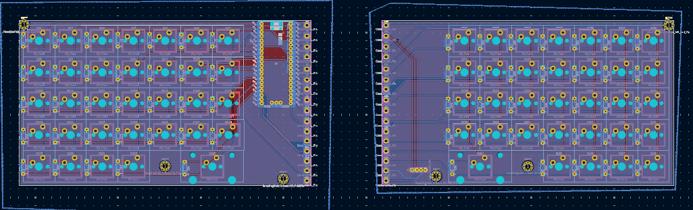
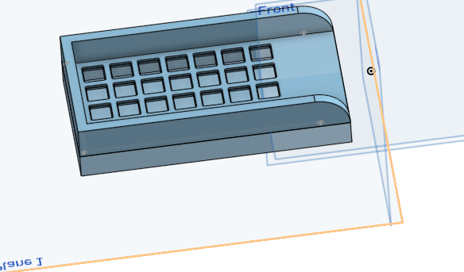
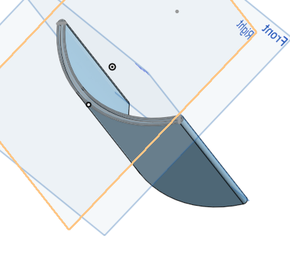
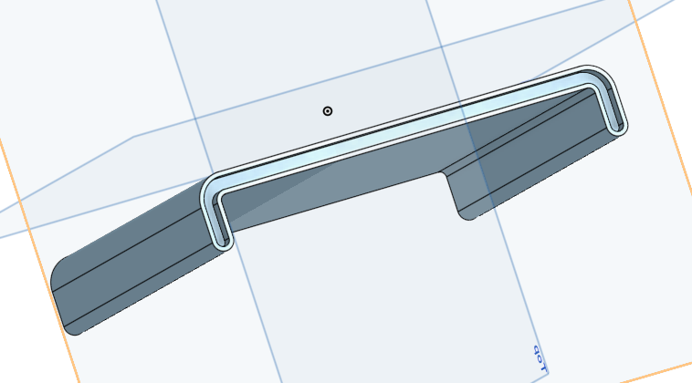

# The Fold Board!

This is a super cool keyboard that I am making

It folds!

and fits nicely in a bag

Total Time spent: 25

## 13th of June

Did the entire pcb in one day.

Since this is technically a split board, I would normally have needed 2 micro controllers and ttrs. But I aint doing allat.

My design uses one microcontroller and uses 16 wires to connect the 2 halves and bring the right side matrix to the left.

The wires can also function as the way the 2 boards are held together(joke there will be more supports)

I still need to add silkscreen so its not technically done but functionality is done.

Anyways explaining the keyboard.

Its a normal keyboard thats about 75%ish idk it has 84 keys. 

it folds and has 16 wires to connect it together

Hours spent: 4

## 15th of June

Started work on the case and trying to guage out how I am going to figure out how to have the 2 halves connect and how I want it to look

Got this so far, spent a few hours on it and looks kinda nice. might do some more work onto it before moving to the fold

Hours spent: 2

## 17-20th June

Did little bits and bobs of work, not too much but small touches on the pcb, and cad whereever i got time.
total time across these days is like 2 hours max

## 21st of June

I am actually stupid.

can you spot the problem here?

thats right

i put 4 rows instead of 5

time to start from scratch again. YAAYAYAYAYA

anyways did lots of work today on my case, went through a few designs, got some of the nitty gritty down, also did a few touches on the pcb but nothing significant.

Time spent: 4 hours

## 23rd of June

Today I went through some designs for the bridge of the 2 halves.

This is what I was originally going for but that doesn't really fit well with the rest of the model. so then I tried a different one.

This one is more straightforward and allows me to make it a bit slimmer. idk if i mentioned this before but i want to be able to push these 2 halves together when it lays on a table. to the bridge needs to be able to fit in the case.

In the end I just settled for a completely flat bridge. I had the curve before because it would go around the top plate but now I had shortened the pcb and plate in order to give the bridge room to sit.

Time Spent: 5 hours

## 29th of June

Okay time to start grinding ts.

I polished up on the case and started adding final details with usb port placement and added the proper placements for keycaps and added my logo onto it.

## Time spent: 2 hours

## 30th of June

Firmware time!

I reinstalled mac and turns out my mac is too old to install qmk so I cant compile code and have to copy paste previous firmware folders and then change the pins and keymaps. Also github copilot is soooooooo good. i love it i love it i love it

It saved me soooooo much time with firmware writing.

it does all the zombie work for you

Sure it has a few hiccups but its still amazing

Time spent: 2 hours

## 1st of June 

I just realised that I need to have some sort of thing to hold it together.

So I made a bit that uses a rubber band to hold

Looks like that for now. might change if it doesnt work

Then I made my BOM by scouring for a bit on aliexpress but most of the stuff was easy to find since i have made a board before and I just used the same places.

Then the readme. That was nice. I think it looks nice, better than my last one at least

Time spent 4 hours

## 2nd of June

Submitted :D
