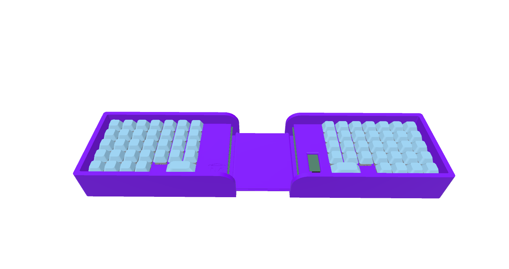

# Fold Board
Made By Overlord Runt // Taran The Idiot

## The Fold Board
Its the second keyboard in my line of Taranium boards. It is a keyboard that folds! It has 66 Keys and an OLED for funny stuff.

If you like this project, please give it a star!

## CAD

Here is a full [CAD Build](https://cad.onshape.com/documents/464e86edd9a4b3695068071c/w/4e80d06eb9a86776c724470c/e/258c53a4e91dc0ec03e526f0) of the keyboard.\
It uses a rubber band to hold the 2 halves together and I am probably gonna have to work on the joint a bit when i get the parts.

The case is 44cm tall when layed flat out which is pretty good for a folding board. I made sure to keep the joint loose but strong enough to stay on so it doesnt wear down as much and stays nice. I suggest printing it from petg so you can get more slip.

Here are some shots of what it looks like open and folded.

I spent majority of my time here going through different renditions of the bridge and trying different ways to make the fold work while keeping it as a keyboard that it viable to use.

## PCB

The pcb was done pretty quickly and I only did about 1 revision while making it.\
The pcb folder contains the original design files while right and left side have the files with the respective side isolated for fabrication purposes. gerbers can also be found in those folders.

I used 16 jumper wires to bridge the connections of one half to the other instead of going for the traditional approach with trrs. I think will add a nice look to it, especially across the bridge.

My schematic is pretty normal. Average split board stuff.

## Firmware

This keyboard uses QMK firmware that can be found in the firmware folder. Unfortunately it isnt compiled as my computer is too old to install the QMK command line but I will update it as soon as I can. For now you need to install the command line yourself [here](https://docs.qmk.fm/newbs_getting_started).

This was probably my fastest firmware built ever. Its all thanks to github copilot. It completely gets rid of all the zombie work. I can finally be free. There is no greater blessing to the world.

## BOM
BOM can be found [here](https://github.com/Overlord-Runt/Fold-Board/blob/main/PRODUCTION/BOM.md) but here is a general list:
- 66 MX Switches
- 66 diodes
- 2 2U stablisers
- 64 1U keycaps
- 2 2U keycaps
- 2 PCBs
- 5 3D printd Case parts
- SSD1306 128x32 OLED
- 16 50mm long wires
- 1 Orpheus Pico(or a normal pico if you dont have one)
- 1 large rubber band
- 8 M3D5L6 Heatsets
- 8 M3 30mm long screws
